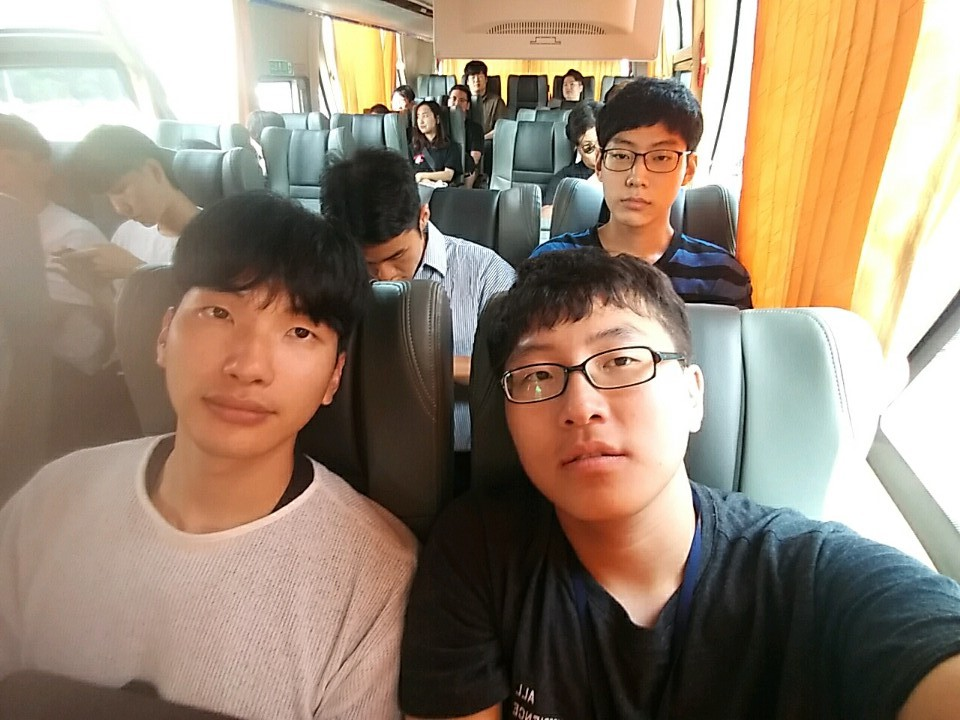
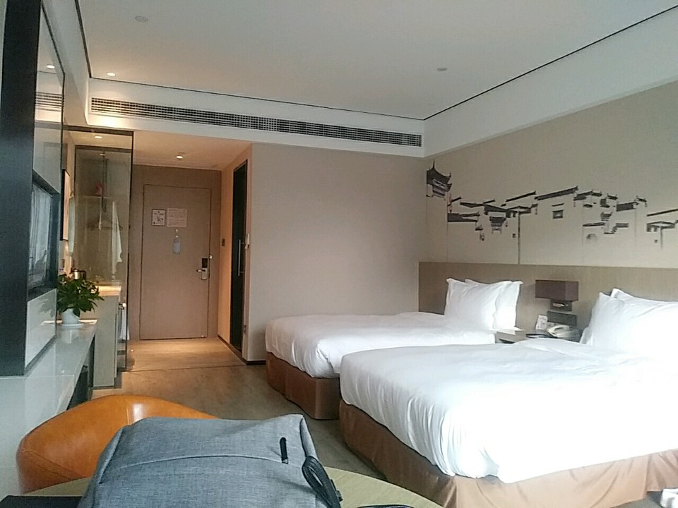
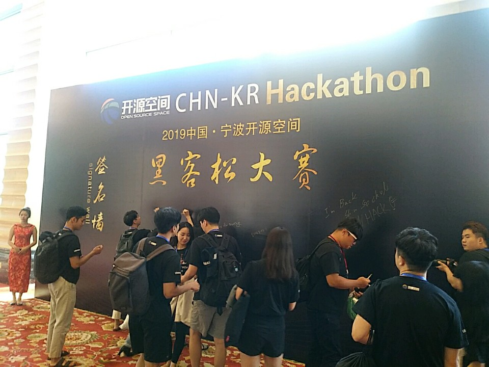
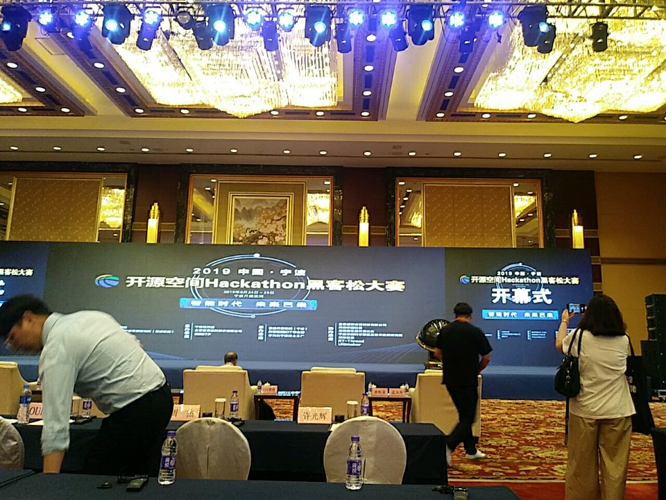

- 2019 CN-KR Hackathon Review By Nakamura
  - 일시
    - 2019.08.23 (금) ~ 2019.08.28 (수), 5박 6일
  - 지역
    - 중국 (닝보, 항주)
  - 주최
    - IITP, 정보통신기획평가원
  - 참여 동기
    - OpenHack 해커톤에서 좋은 결과를 운 좋게 얻어서 참여하게 되었습니다.
    - 딱 저 일정동안 시간이 비었고, 좋은 친구, 멘토님들과 함께 갈 수 있다는 부분이 너무 좋았습니다.
      - 오픈핵 해커톤 때는 서로 개발하기만 바쁘다보니 다른 팀들과 친해질 기회가 없어서 친해질 수 있는 기회가 되지 않을까 싶었습니다.
    - 중국에서도 좋은 결과를 얻어오자라는 팀 내부의 동기부여를 받고 자신은 없지만(?) 신청하게 되었습니다.
  - 1일차
    - 인천공항 1터미널 A 구역에서 만나서 여권, 티켓 등 필요한 자료들을 건네받고 탑승 수속을 함 
    - 끝내고 각자 헤어져서 면세점 근처 식당에서 불고기 비빔밥으로 아침식사
    - 비행기 탑승할 때 점심 시간이었는데 기내식으로 불고기 비빔밥이? ㅠㅠ
    - 도착해서 가이드 님을 만나고 가는 중에 중국에는 하수도 시설이 잘 안되어 있구나라고 알게 됨
      - 
      - 
    - 첫 호텔 가는 중
      - 팀끼리 첫 사진! 너무 피곤해 보이는데? 
      - 
    - 첫 호텔 
      - 들어가자마자 보이는 해커톤 ㅠㅠ
        - 이 때 도망치고 싶다는 생각이 ㅋㅋㅋㅋ
        - 
      - 방과 식당이 너무 좋은데?? 
        - 
        - 
      - 이렇게 중국에 도착하고 나서, 짐 풀고 정비하는 데 하루를 보냄 
  - 2일차 ~ 3일차
    - 본격적인 해커톤 시작!
      - 가자 개회식하러 ㅠㅠㅠ
        - 
      - 와... 너무 좋은데?? 혹시 해커톤을 여기서 하는 건가?
        - 
        - 
    - 개회식 및 중국, 한국 학생들의 대표 발표
      - 
      - 
      - 
    - 개회식이 끝나고 알리바바 IOT 개발자 및 엔지니어 분들의 기술 강연이 시작되었습니다.
      - 아키텍처 및 어떤 것을 배워야 하고 알아가야 할 지 많이 배워야 할 부분을 알게 되었습니다.
      - 이 부분에서 듣고 적은 내용들을 복습해서 실력을 키워나가려고 합니다.
        - 의외로 컴퓨터 학과 내에서 배웠던 내용들 + 심화 부분들이 많이 나와서 궁금했던 점을 해결했던 부분들이 있었습니다.
      - 
    - 다른 장소로 이동해서 해커톤을 진행하였습니다.
      - 해커톤을 하게 되면 밤을 새서 개발하기 떄문에 구지 호텔에 짐을 둘 필요가 없음 
      - 
    - 바로 팀 별로 자리를 잡아 하루 종일 개발하기 시작함 
      - 저희 팀 목표 : Pose estimation 기술을 이용한 개발을 조금 더 개선하는 방향으로 발전시키자!
      - 과정 
        - 전날 VPN을 미리 팀원들이 각자 준비해서, Google, Github을 조금 여유롭게 사용할 수 있도록 함
        - 당일 날, 환경설정 따로 없이 바로 개발에 들어감
        - React, Firebase를 이용해서 전과는 다른 디자인과 기능을 넣어보려고 노력함 
        - 미리 만나려고 노력해서 어느 정도 구상 및 만든 상태에서 갔다면
          - 더욱 잘 만들 수 있지 않았을까 라는 아쉬움이 ㅠㅠ
      - 결과
        - 이규원 팀장님, 황지희 디자이너님의 완벽한 발표 덕분에 수상을 하게 됨
        - 
      - 배운 점
        - 새로운 기술을 도입할 때는 서로 충분한 대화 및 공부가 필요하다는 것을 알게 됨
        - 혼자할 때와는 다른 문제가 생긴다는 부분
          - 개발 방법, 디자인 등 협업해야 하는 부분들이 끊임없이 발생함
            - 여기서! 어떻게 합의점을 찾을 것인가가 팀원들 사이에서 가장 큰 토의점이 아니었는가?? 라는 생각
        - 그래서 더욱 겸손하게 끊임없이 배워가야 한다는 것을 뼈저리게(?)(심하게) 느낌
        - 팀원들에게 너무 감사하고 모두 열심히 했으니까 후회없이 대회를 마쳐서 매우 보람찬 부분이었습니다.
  - 4일차 
    - 화웨이 
      - 중국 ICT 분야에 선두 주자로 활약하고 있는 회사
      - 닝보 - 스마트 팩토리 건설에 큰 역할을 함
        - 
        - 
        - 
        - 
      - 1층에서 화웨이와 협업하는 회사들 소개 및 집중하고 있는 분야 소개 후
        - 올라가서 다양한 질문들에 답변을 해 주시는 방식으로 일정을 마무리
    - 닝보대학교 컴퓨터공학과
      - 중국의 컴공 학생들은 무엇에 중점을 두고 공부하며 생활하고 있는지 알게 됨
      - 
      - 연구실들을 보여주시면서, 현재 연구하고 있는 프로젝트에 대한 간략한 설명을 해주셨습니다.
      - 회의실에 모여서, Q&A를 진행하였는데
        - 
        - 닝보대학교에서는 IT의 어떤 분야에 중심으로 신경쓰는지, 무엇을 공부하며 어떠한 역량들을 중심으로 실력을 키워가는지에 대해 물어보며 궁금증을 해소할 수 있었습니다.
    - 같이 저녁 먹고 새로운 호텔에서의 하루를 마무리
      - 
      - 
        - 방이 너무 좋아서 숙소 걱정은 안 하고 헬스장도 있어서 일과 끝나자마자 운동하러 갔었네요
  - 5일차
    - 위닥터
      - 온라인 진료 예약 서비스 플랫폼을 만드는 기업
        - 내년부터는 전체 중국으로 확대될 전망이라고 하니다.
        - 특히 실습을 하는 것을 지켜보면서 너무 신기하다는 것을 느꼈는데, 아쉽게도 한국에서는 실행되지 못할 부분이 아닌가라는 생각이 들었습니다.
          - 우리나라도 하면 분명 많은 도움이 될 거 같은데
            - 개인정보 문제가 너무 크게 차지한다고 하시네요 ㅠㅠ
          - 
          - 
      - 
      - 
      - 
    - 한인 개발자 간담회
      - T자형 인간이 되자?
        - 깊이와 넓이를 모두 갖춘 개발자가 되어야 한다.
        - 하지만 지금은 하나의 기술에 전문성을 가져야 함
      - 우리는 평소에 시간을 어떻게 사용하고 있는가?
      - 기본적인 습관(사람의 눈을 맞춘다 등)이 갖추어져 있어야 한다. 
      - 김덕영 개발자님, 이우헌 개발자님과의 간담회
        - 저녁 식사를 함께 하였습니다. 
          - 얘기를 나눌 때마다 너무 공감이 되어서 저도 모르게 한참 동안 고민하면서 이야기를 들었던 기억이...
          - 이렇게 타지에서 한인 개발자를 만날 수 있다는 기회가 학생 입장에서는 만나기 너무 힘들어서
            - 현업 개발자님들의 개발 환경, 정착기, 경험들을 들으면서 한층 더 성장할 수 있었습니다.
        - 
        - 
  - 후기
    - 우물 안 개구리였던 저를 의지, 마음을 다질 수 있었던 경험이었습니다.
      - 다른 사람들 앞에서 말하는 거, 행동하는 것을 두려워했었는데, 신수철 운영자님 덕분에 극복할 수 있었고 자신감이 생겼습니다.
    - 어떠한 마음가짐으로 공부를 하고 있는가에 대해서 깊이 생각해 볼 수 있는 계기
      - 스스로 질문을 많이 하고 반성하는 시간
      - 언제까지 이렇게 살 수는 없지 않을까?라는 질문을 끊임없이 했던 거 같아요
        - 
    - 해커톤 및 여러 군데를 돌아다니면서 좋은 사람들을 만날 수 있어서 너무 좋았습니다.
      - 모두 주의 깊게 설명을 듣는 모습
        - 매 순간에 열심히 하면 얻는 것이 많겠구나라는 생각에 저도 같이 듣게 되더라구요
        - 
      - 음.... 흑역사가 되지 않을까?
        - 
      - 
        - 크 뭔가 깔맞춤한 듯한 느낌이??
      - 
        - ㅋㅋㅋㅋㅋ 말이 필요할까요?? 
        - 사랑합니다 운영자님!
      - 
        - 항상 너무 잘 찍어주셔서 감사합니다!
    - 윤경진 책임님, 신수철 운영자님, 어다진 주임님,  안소영 과장님, 양주현 주임님, 전미자 가이드님께 
      - 제가 말, 행동에서 실수한 부분에도 잘 대해주시고, 많이 도와주셔서 정말 감사합니다!
    - 그리고 김민현 멘토님, 권아영 멘토님 
      - 어려움이 있을 때마다 항상 도와주셔서 감사합니다.
      - 제 호기심으로 인한 질문에도 대답해주셔서 오히려 죄송합니다 ㅠㅠ
    - 같이 함께했던 친구들에게 마지막으로 너무 감사한 마음을 전하고 싶습니다.