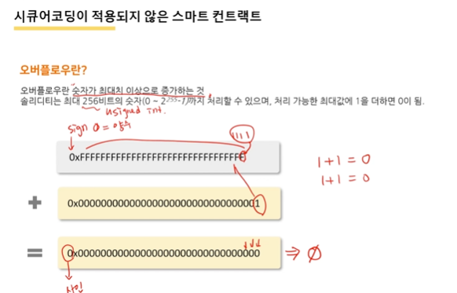

- 보안사고사례와 시큐어코딩 온라인 강의

  - 스마트컨트랙 시큐어코딩 부재 사고 사례
  - SQL 인젝션 사고사례
  - 접근 제어 미흡 사고 사례
  - 무작위 대입 공격 사례
  - 학습 목표
    - 사고사례를 통해 시큐어코딩의 필요성을 이해

  

  

  

- SafeMath라는 시큐어 연산 프로그램을 사용해서 개발하는 것을 권고하고 있음 
  - 스마트 컨트렉을 작성시 얼마나 중요한지 알려주는 사건 

- 반드시 제거하도록 권고하고 있음 => 주의를 기울여라

- 취약점 대응에 대한 문제점도 보여준 문제 

