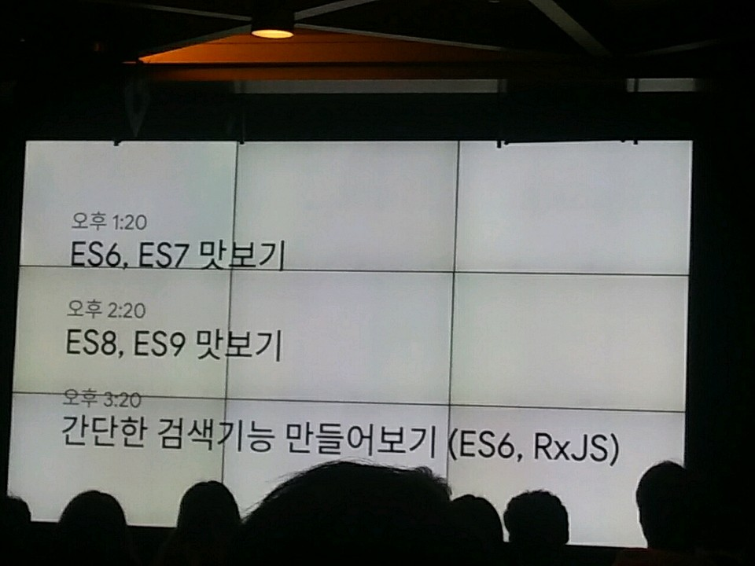
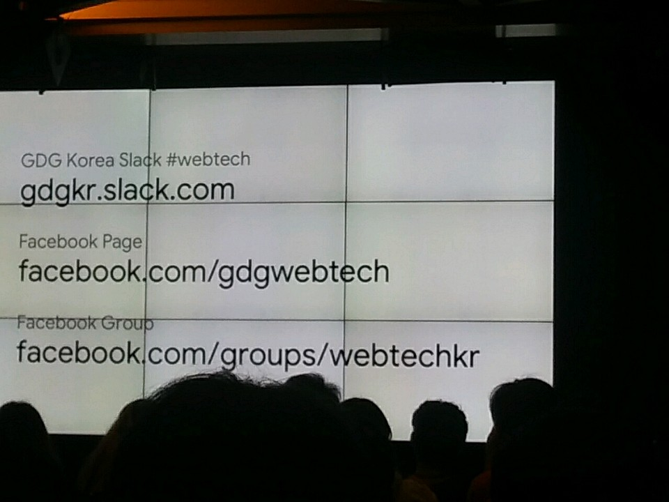
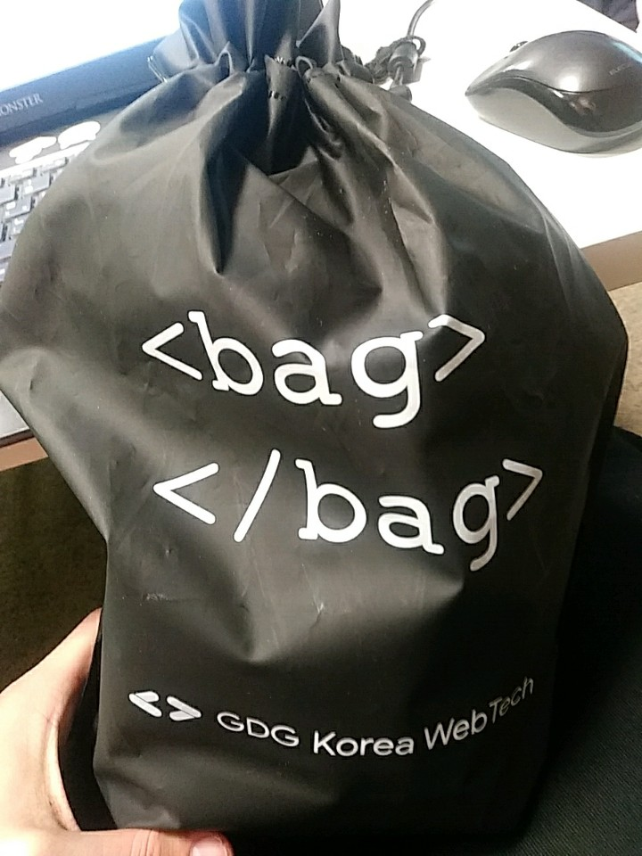
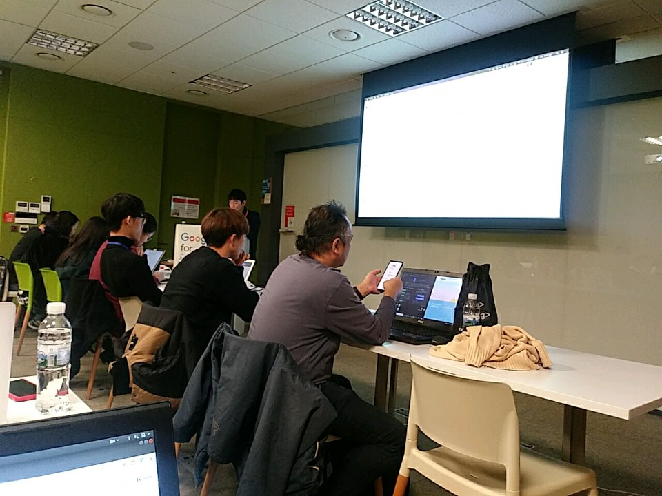

# 2019 GDG Web Tech -> DevFest with Chrome Dev Summit Extended 

- SW 마이스터고 멘토 끝나고 과제 중 어떤 분의 도움으로 갈 수 있게 된 행사 -> God 얼굴책
  - 다시 한 번 감사드립니다!
- 아직 기본도 없는데 많은 것을 처음부터 배울 수 있어서 너무 좋았습니다.
- Codelab 세션에 중점을 두어 참여했습니다.
  - 나머지도 듣고 싶었지만 이렇게 JS에 대해 알 수 있다는 기회가 거의 없어서.....
  - 너무 배우고 싶어서 빨리 들어갔네요



- 기본 참여 관련 링크



- 가방 뭐지 이거 ;;;



- 모두 너무 열심히 하시고, 특히 강사님께 좋은 강의 해주셔서 다시 한 번 감사드립니다




# 실습 

- 번들링에서 실수를 너무 많이 함 => 다시 공부하자

webpack -p --watch
- -p : 프로덕션 레벨 => light하게 확인할 수 있음 
- --watch : 변경 탐지

- keydown, keypress에서 공백 문자가 넘어오는 경우가 있음 
- =>  app.js에 이벤트 방식을 input 으로 한 이유

- webpack -> 번들링을 위한 라이브러리가 다 있어 
- webpack-cli를 npm script로 불러 사용할 듯
- dist 폴더에 webpack 결과물을 넣음 


- 파일을 주시하다가 계속 빌드할 거임
- -> npm script에 watch를 넣은 이유

- debounce, throttle
- 주어진 밀리세컨드 만큼의 debounce 하는 새로운 함수를 반환
- 가장 뒤쪽에 있는 녀석을 리턴 => 실행시킨다는 의미
- debounce 안에 있는 setTimeout이 주어진 time 내 안 이벤트를 무시
- 동일한 결과를 찾는다면 => API 호출 직전에 
    이전 value와 동일한지 체크해서 보내자
- 네트워크 낭비를 줄일 수 있음 => time을 줄일 필요가 있음 


```javascript
fetch(`${apiEndPoint}?f=${inputValue}`, {
    method: 'GET',
  })
```
- ?f : 쿼리 스트링인듯?

- 사용자의 UX를 최대한 보장하기 위해 백엔드 엔지니어를 믿으면 안 된다.

- 쳐서 API가 날아가는 시점 -> 응답이 오는 시점 => 리스트 안에다가 loading indicator를 보여주면 됨

- API 호출하기 직전 부터 도착하기 딱 직전 


---

# RxJS

- RxJS => 관개 수로 -> 파이프라인을 표현한다 
- 들어오는 데이터를 Observable이라는 객체로 표현
- 행위를 도와주는 녀석 -> Operator 
- time 연속적으로 들어오면 작용하게 해줌

- 관개 수로를 실제로 이용할 사람 => Observer
- Observer가 observable을 사용해서 데이터를 꺼내오는 활동을 subscription이라고 함 

- 주의!
- 구독을 한다고 하는 것은 RxJS는 내부적으로 이벤트 리스너를 걸어둔다는 의미
- 메모리 누수가 일어나는 경우가 너무 많음 
- 많이 걸어두면 안 됨
- 구독 해지를 하면 됨 -> unsubscription으로 할 수 있어 

- fromEvent : DOM -> Observable
- pipe : Observable 객체 안에 있음
- pipe는 동일한 객체가 아닌 실행 후 새로운 객체를 반환
- RxJs도 debounceTime을 지원 
- distinctUntilChanged => 바뀌기 전까지는 넘어온 데이터가 다음으로 넘어가지 않는 다는 의미 => 구별
- => 바뀌면 넘길 수 있음
- tap: log을 도중에 쉽게 남길 수 있는 부분 -> 툭 쳐주는 것?
- api 호출도 언제올지 모르는 데이터를 표현 => RxJs에선 ajax도 observable을 리턴 => Promise 리턴 안 함
- 중첩된 파이프라인이 완성됨 => 이렇게 짜면.
- ajax 파이프라인 안에 있던 value를 꺼내서 바깥에 Observable 객체를 사용할 수 있어야 함
- ===> mergeMap, switchMap
- switchMap : 이전에는 파이프라인이 넘어가다, 
- RxJs의 ajax는 에러가 나면 response가 null => 삼항 연산자를 쓴 이유
- 상위 파이프라인에서 합쳐짐
- switchMap은 안에 있는 파이프라인을 상위 파이프라인에 합쳐주기도 하면서 pending된 요청은 무시한다
- ==> 이말은 요청이 지연이 되었을 때 새로운 요청에만 응답을 한다

- switchMap : 이전 요청을 cancel한다 


------

공사하는 것과 비슷 
=> 앱이 부드럽게 돌아가는 경험을 할 수 있음 


- 마지막 세션 - 웹 개발로 만드는 동영상 편집기

  - 불연속 구간 재생, 오디오 버퍼 관리, 자막 처리

  - Vrew -> 인공지능 영상편집기 

  - 영상 편집기의 두 기능 

    - 작업 도중 계속 확인 (preview)
    - 최종 파일 만들기 (encoding)

  - 이미 끝판왕 존재 

    - FFMPEG -> 최종 파일은 이걸로 가능!
      - 첫 번째는?
      - Electron으로 만듬 (Chrome, Node.js)
        - OS 독립적, 강력한 CSS 디자인, 증명된 성능, 차고 넘치는 예제, sandbox 한계 X
        - 레퍼런스 X, 저수준 얼마나 필요한지 모름 

    1) 불연속 구간 생김

    - 동영상이라는 도메인 지식 필요
    - encoding : 압축, decoding : 압축 해제, RAW한 데이터
    - 영상 : 프레임이 기본 단위

    - Decode 했을 때의 크기 -> 비디오 큰 문제
      - 압축된 Frame의 종류 
      - delay 발생 가능성
      - Gomplayer라는 트릭이 존재, 근처의 I-Frame을 다 찾음
      - 믿을 구석은 HTML5 = Media Source Extensions
    - Audio는 웹에 디코딩이 가능 
      - Audio, Video간 Sink가 안 맞게 됨
      - video.playbackRate = 1.2? => 빨리감기?

    2) 오디오 버퍼 관리

    - WebAudio = W3C
      - 중간 filter를 거칠 수 있음 
    - Audio samples -> 공기의 떨림
      - sample rate -> 얼마나 딸 것인가

    3) 자막 처리

    - font, color, line break, weight, position, style 등 생각해야 할 게 많음
    - ASS format -> 유연한 편집 자막 엔진
      - Preview -> libjass (DOM)
      - output -> libass(FFMPEG)
    - ASS format의 단점을 web Assembly가 가능해지면서 libass(FFMPEG가 가능)
    - redux undo / redo 
      - 계속 snapshot -> 참조를 날림 -> gc
      - 이걸 저장을 해둔다면? -> undo가 가능

  - 필터 / 트랜지션 (LUT/전환효과)

    - WebGL
    - 이미지 올리기 - Moveable

  - 영상 편집기 관점에서의 web 기술

    - 풍부한 라이브러리 생태계 이용 가능
    - WebAssembly로 외부 라이브러리 점점 더 사용 가능
    - UX 구현 비용 줄임(HTML 5/CSS 3)
    - Media source Extension으로 비디오 편집이 제약 존재
    - webAudio -> 매우 완벽
    - WebGL, glsl -> 하드웨어 가속 받는 실시간 필터 구현 